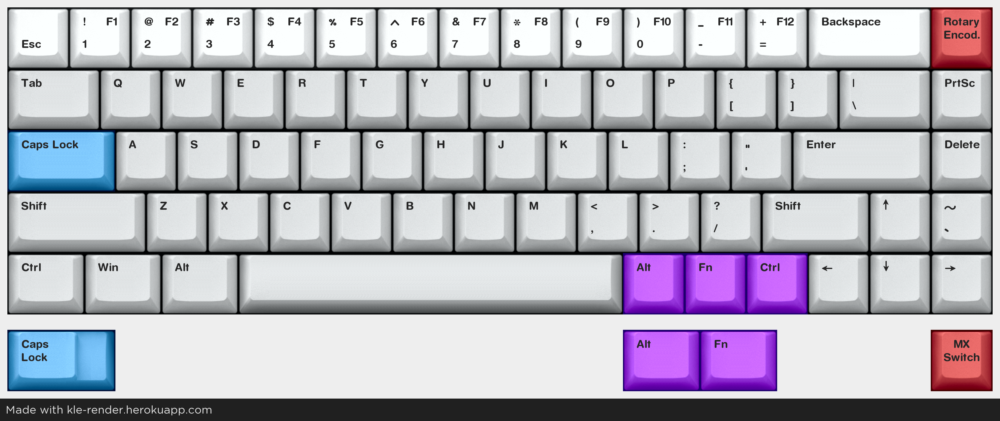
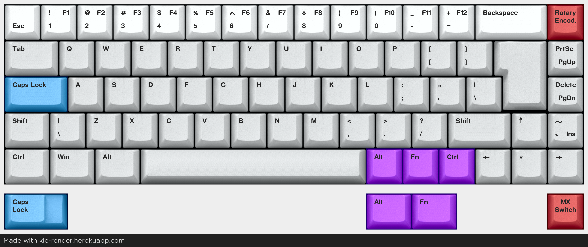

# mini eLiXiVy firmware files
Depending on the layout chosen for the eLiXiVy, a different firmware version may be suitable.
This folder has three firmware types available: default, ansi and iso.
As a reminder, the eLiXiVy supports these layouts:

## Default
This is a barebones firmware with an ansi layout:

## ansi
This is like the default firmware, but with some added functionality under the Function layer

## iso
While the default and ansi firmware are both using the ansi layout, the iso firmware uses the iso layout, with its backslash key on the left and iso (upside-down L) Enter.

## Extra options on the firmware versions
Each version of the firmware still has support for a couple different options, such as stepped Caps Lock or not and two or three modifiers between Space and the Arrow Keys. It doesn't matter which of these is used, the firmware will support both.

## Should these firmware versions not work
In the case these firwmare versions don't match your build - either in physical sizes or keycodes - it's possible to edit the keymaps to suit your need.
Refer to the section [6.6] of the Assembly Guide for more information on editing the keymap.